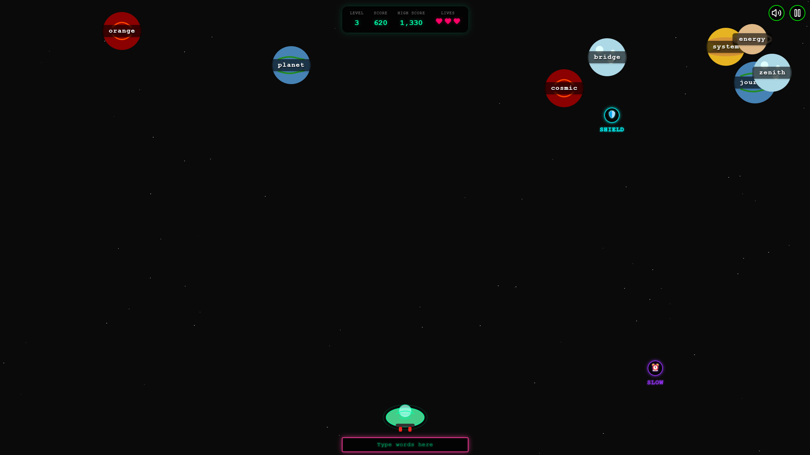

# Word Blast 🚀

A fast-paced typing game where you defend Earth from alien words by typing them correctly. Blast aliens with your laser typing skills and collect power-ups to help you survive the invasion!

<p align="center">
  <a href="https://youtu.be/your-video-id">
    
  </a>
  <br>
  <em>Click the image to watch the gameplay demo</em>
</p>

## 🎮 Play Now!

You can play Word Blast right now in your browser:
[**Play Word Blast**](https://word-blast-game.vercel.app/)

## ✨ Features

- **Fast-paced Typing Action**: Type words to destroy alien planets before they reach Earth
- **Progressive Difficulty**: Game gets harder as you advance through levels with more challenging words
- **Power-ups System**: Collect special power-ups like shields and time-slowing abilities to gain advantages
- **Visual Effects**: Stunning lasers, explosions, and space-themed visuals enhance the gameplay experience
- **Sound Effects**: Immersive sound design with background atmosphere and reactive action sounds
- **Level Progression**: Complete levels by destroying a specific number of aliens, with increasing challenge
- **Score System**: Earn points based on word length and typing speed

## 🎮 How to Play

1. **Start the Game**: Click the "START" button on the main screen
2. **Type Words**: Type the words displayed on the alien planets to destroy them
3. **Avoid Invasions**: Don't let the aliens reach the bottom of the screen or you'll lose lives
4. **Collect Power-ups**: Type special power-up words when they appear:
   - 🛡️ **SHIELD**: Temporarily protects you from aliens reaching Earth
   - ⏰ **SLOW**: Slows down all aliens on screen for a limited time
5. **Complete Levels**: Destroy the required number of aliens to advance to the next level
6. **Survive**: Try to reach the highest level and score possible!

## 🚀 Getting Started

This is a [Next.js](https://nextjs.org) project. To run it locally:

```bash
# Clone the repository
git clone https://github.com/yourusername/word-blast.git
cd word-blast

# Install dependencies
npm install

# Run the development server
npm run dev
```

Open http://localhost:3000 in your browser to see the game in action.

## 🛠️ Technologies Used

- Next.js - React framework for the application
- TypeScript - For type-safe code
- TailwindCSS - For styling and responsive design
- React Hooks - For state management and side effects
- Web Audio API - For sound effects and background music
- CSS Animations - For visual effects and transitions

## 📱 Responsive Design

Word Blast is designed to work on various screen sizes:

- Desktop : Optimal experience with keyboard input
- Tablet : Playable with on-screen keyboard
- Mobile : Adapted layout for smaller screens

## 🔧 Project Structure

    word-blast/
    ├── app/          # Next.js app directory
    ├── components/   # React components
    │   ├── game/     # Game-specific components
    │   └── common/   # Shared UI components
    ├── hooks/        # Custom React hooks
    ├── public/       # Static assets
    │   └── sounds/   # Game sound effects
    ├── types/        # TypeScript type definitions
    └── utils/        # Utility functions

## 🤝 Contributing

Contributions are welcome! If you'd like to contribute:

1. Fork the repository
2. Create a feature branch ( git checkout -b feature/amazing-feature )
3. Commit your changes ( git commit -m 'Add some amazing feature' )
4. Push to the branch ( git push origin feature/amazing-feature )
5. Open a Pull Request

## 📝 License

This project is licensed under the MIT License - see the LICENSE file for details.
